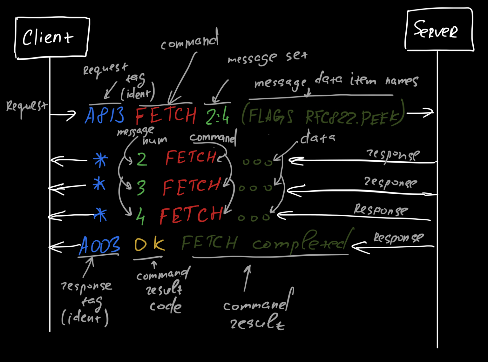

# IMAP

[RFC1730](https://www.rfc-editor.org/rfc/rfc1730.html#section-6.4.5)

## Fetch and do not mark seen

- `imap_conn.fetch(uid, '(RFC822.PEEK)')` or `imap_conn.fetch(uid, '(BODY.PEEK[HEADER])')`
- `imap_conn.select('Inbox', readonly=True)`

[source](https://stackoverflow.com/questions/3283460/fetch-an-email-with-imaplib-but-do-not-mark-it-as-seen)
