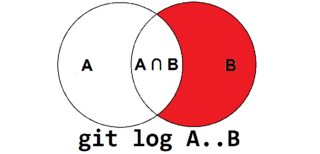
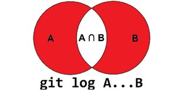
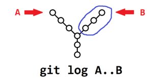
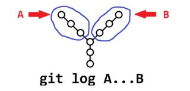
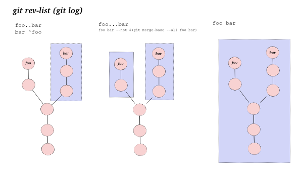
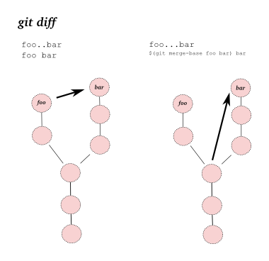

.gitconfig
----------
my config:
```ini
; default user info
[user]
    name = atronah
    email = atronah.ds@gmail.com

[help]
    ; "info" - corresponds to -i|--info,
    ; "web" or "html" correspond to -w|--web.
    ; "man" corresponds to -m|--man,
    format = html

[core]
    autocrlf = true
    ; to prevent troubles with cyrillic in console (see https://habrahabr.ru/post/74839/)
    quotepath = false

[i18n]
    ; NOTE: to make Vim display cyrillic correctly you have to set LANG=ru_RU.UTF-8
    ; no longer needed, becouse default settings work correct
    #commitencoding = utf-8
    #logoutputencoding = utf-8

[pull]
    ; to prevent merge
    ff = true
    ; try to rebase your local changes on top of remote branch during pull. 
    ; instead I prefer to use alias "pullr" (see bellow)
    #rebase = true

[push]
    default = simple
    ; to prevent fast-forwarding during push
    #ff = false

[merge]
    ; to prevent fast-forwarding during merge
    ff = false

[credential]
    ; to store your credentials into .git-credentials file
    helper = store

[alias]
    ci = commit
    fx = commit --fixup
    br = branch
    st = status
    co = checkout
    un = reset HEAD --
    ol = log --oneline
    mr = merge --no-ff
    last = log -1 HEAD
    unstage = reset HEAD --
    rollback = checkout --
    graph = log --graph --abbrev-commit --decorate --date=relative --format=format:'%C(bold blue)%h%C(reset) - %C(bold green)(%ar)%C(reset) %C(white)%s%C(reset) %C(dim white)- %an%C(reset)%C(bold yellow)%d%C(reset)' --all
    hist = log --pretty=format:'%h %ad | %s%d [%an]' --graph --date=short
    sm = submodule
    type = cat-file -t
    dump = cat-file -p
    pulr = pull --rebase
	wdiff = diff --word-diff=color
    ; format to html with link to commit (like "http://gitlab.com/{group}/{project}/%H")
    html = log --pretty=format:'<h3>%ad <a href="http://gitlab.com/{group}/{project}/%H">%h</a> %s</h3>%n<pre>%b</pre>%n' --date=short --author=atronah
    ; extended html with three arguments: date, group name, project name.
    htmlex = "! f() { git html | sed -n -e \"/<h3>$1/,/<\\/pre>/ p\" | sed "s/{group}/$2/g" | sed "s/{project}/$3/g"; }; f"

[gui]
    encoding = utf-8
```


gitrevisions
------------
`@{u}` (“u” stands for “upstream”) it resolves to the latest commit on this branch on the remote ([merge-vs-rebase](http://mislav.net/2013/02/merge-vs-rebase/))
- parents of commit (usual commit has only one parent, but merge can has more)
    - `<ref>^0` - commit itself
    - `<rev>^` (equivalent `<rev>^1`) - first parent of commit 
    - `<rev>^<n>` - `<n>`th parent of commit
- `<rev>~<n>` - `<n>`-th ancestor of commit (note that `<rev>~3` is equivalent to `<rev>^^^` (great-grandparent of of commit) or `<rev>^1^1^1`
- specifying type of commit
    - `<ref>^{tag}` - can be used to ensure that rev identifies an existing tag object.
- `<ref>^{:/regexp}`- the youngest commit which is reachable from the `<rev>` and which is reachable from any ref
- `<ref>^{/regexp}` - the youngest commit which is reachable from the `<rev>` and which is reachable from the `<rev>`


rebase
------
see more in [git rebasing](https://git-scm.com/book/en/v2/Git-Branching-Rebasing)

`git rebase --onto master server client` - Take the client branch, figure out the patches since it diverged from the server branch, 
and replay these patches in the client branch as if it was based directly off the master branch instead:


double and triple dots
----------------------
Some images got from [StackOverflow topic](http://stackoverflow.com/questions/462974/what-are-the-differences-between-double-dot-and-triple-dot-in-git-com)

|  |      | 
|---------------------------------------------|-------------------------------------------------|
|        |   |
|         |                | 


-----------------


Best practices
==============

commit message
--------------
_some of rules was borrowed from [AngularJS](https://github.com/angular/angular.js/blob/master/CONTRIBUTING.md) project_

Commit message have to match the pattern:
```
<type>(<scope>): <subject> [#<ticket number>]
<blank line>
<detailed description>
<blank line>
<other metadata>
```
where:
- `<type>` - one of the following keywords to simplify the automatic generation of changelog:
	- **fx** - A bug fix
	- **ft** - A new feature
	- **rf** - A refactoring (changes without changing behaviour)
		- **cln** - removing files, extra spaces, blank lines, unused variables
		- **opt** - optimisation 
		- **stl** - A code reformatting (removes blank lines, extra spaces, case changing, etc)
	- **docs** - a documentation of code
	- **sm** - A submodule changing
	- **misc** - miscellaneous changes
- `<scope>` - name of changes scope (or modified file name in simple case)
	- **refs** - references (e.g., external documents)
	- **meta** - meta data about project (version, licenses, todoes)
- `<short description>` is a short changes description of commit in Present tense, which answers the question "what does this commit do?".
- `<ticket number>` - (optional) related issue number
- `<detailed description>' - more detailed multi-line description of made changes
- `<other metadata>` - tags for search, meta data for various parsers


-----------------


Links
=====
- https://githowto.com/ru
- http://www-cs-students.stanford.edu/~blynn/gitmagic/intl/ru/ch05.html
- https://githowto.com/ru/history
- https://habrahabr.ru/post/161009/
- http://mislav.net/2013/02/merge-vs-rebase/
- https://git-scm.com/book/ru/v1/Ветвление-в-Git-Перемещение
- http://stackoverflow.com/questions/269352/patch-vs-hotfix-vs-maintenance-release-vs-service-pack-vs
- https://github.com/imangazaliev/git-tips